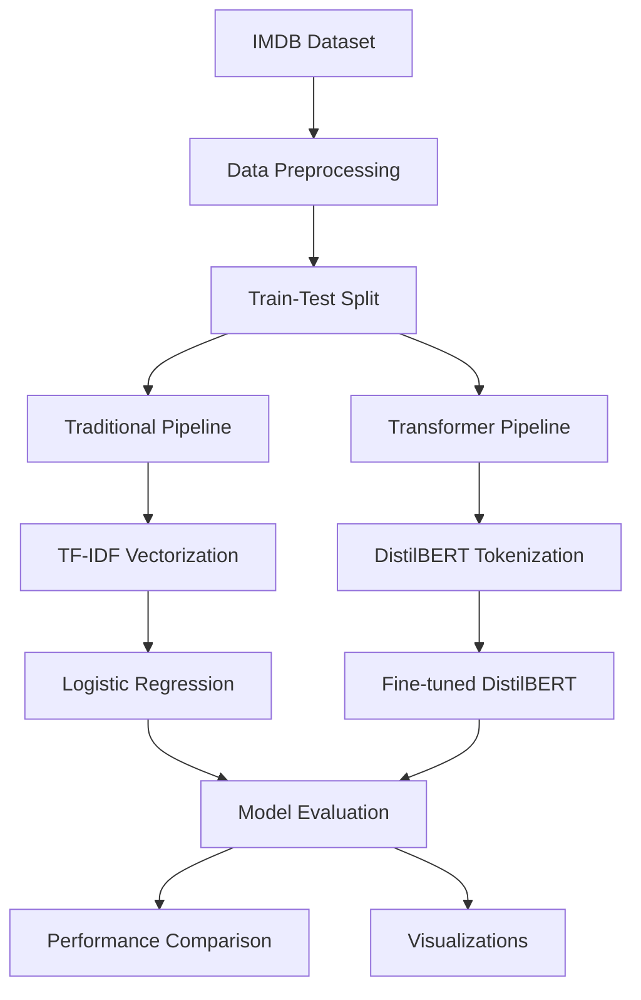

# Project Aether: Sentiment Analysis Comparison

<div align="center">


*A Comparative Analysis of Traditional Machine Learning and Transformer-based Approaches for Sentiment Analysis*

[📊 View Results](#results) • [🚀 Quick Start](#quick-start) • [📖 Documentation](#documentation) • [🤝 Contributing](#contributing)

</div>

---

## 📋 Table of Contents

- [Overview](#overview)
- [Features](#features)
- [Architecture](#architecture)
- [Installation](#installation)
- [Quick Start](#quick-start)
- [Dataset](#dataset)
- [Models](#models)
- [Results](#results)
- [Usage](#usage)
- [Project Structure](#project-structure)
- [Performance Metrics](#performance-metrics)
- [Visualizations](#visualizations)
- [Contributing](#contributing)
- [License](#license)
- [Citation](#citation)
- [Contact](#contact)

---

## 🎯 Overview

**Project Aether** is a comprehensive comparative study that evaluates the performance of traditional machine learning approaches against modern Transformer-based models for sentiment analysis. Using the IMDB movie reviews dataset, this project demonstrates the trade-offs between computational complexity and accuracy in natural language processing tasks.

### Key Highlights

- 📊 **90.1% accuracy** achieved with DistilBERT Transformer
- ⚡ **89.0% accuracy** with traditional TF-IDF + Logistic Regression
- 🔍 **Comprehensive evaluation** across multiple metrics
- 🎛️ **Interactive model comparison** with visualizations
- 📝 **Production-ready code** with detailed documentation

---

## ✨ Features

### 🤖 Machine Learning Models
- **Traditional Approach**: TF-IDF Vectorization + Logistic Regression
- **Modern Approach**: Fine-tuned DistilBERT Transformer
- **Custom Prediction Pipeline**: Real-time sentiment analysis for new text

### 📊 Evaluation Metrics
- Accuracy, Precision, Recall, F1-Score
- ROC Curve Analysis and AUC Score
- Confusion Matrix Visualization
- Training Time Comparison

### 🔧 Technical Features
- **Data Preprocessing Pipeline**: HTML removal, tokenization, lemmatization
- **Stratified Train-Test Split**: Balanced dataset splitting
- **Model Persistence**: Save and load trained models
- **Custom Testing**: Evaluate models on user-provided sentences

### 📈 Visualization
- Performance comparison charts
- ROC curve analysis
- Confusion matrix heatmaps
- Training history plots

---

## 🏗️ Architecture



---

## 🛠️ Installation

### Prerequisites

- Python 3.8 or higher
- CUDA-compatible GPU (optional, for faster training)
- 8GB+ RAM recommended

### Quick Install

```bash
# Clone the repository
git clone https://github.com/danish296/project-aether.git
cd project-aether

# Create virtual environment
python -m venv venv
source venv/bin/activate  # On Windows: venv\Scripts\activate

# Install dependencies
pip install -r requirements.txt

# Install additional NLTK data
python -c "import nltk; nltk.download('punkt'); nltk.download('stopwords'); nltk.download('wordnet')"
```

### Dependencies

```txt
tensorflow>=2.8.0
transformers>=4.15.0
datasets>=1.18.0
scikit-learn>=1.0.0
pandas>=1.3.0
numpy>=1.21.0
matplotlib>=3.5.0
seaborn>=0.11.0
nltk>=3.7
kaggle>=1.5.12
```

---

## 🚀 Quick Start

### 1. Setup Kaggle API (Required for dataset)

```bash
# Place your kaggle.json in ~/.kaggle/ directory
mkdir -p ~/.kaggle
cp kaggle.json ~/.kaggle/
chmod 600 ~/.kaggle/kaggle.json
```

### 2. Run the Complete Pipeline

```python
# Open and run the Jupyter notebook
jupyter notebook Project_Aether_Sentiment_Analysis.ipynb
```

### 3. Quick Prediction Example

```python
from sentiment_predictor import SentimentPredictor

# Initialize predictor
predictor = SentimentPredictor()

# Predict sentiment
result = predictor.predict("This movie was absolutely fantastic!")
print(f"Sentiment: {result['sentiment']}, Confidence: {result['confidence']:.2f}")
```

---

## 📊 Dataset

### IMDB Movie Reviews Dataset

- **Source**: [Kaggle IMDB Dataset](https://www.kaggle.com/datasets/lakshmi25npathi/imdb-dataset-of-50k-movie-reviews)
- **Size**: 50,000 movie reviews
- **Classes**: Binary (Positive/Negative)
- **Split**: 80% Training, 20% Testing
- **Balance**: Equally distributed classes

### Data Preprocessing Pipeline

1. **HTML Tag Removal**: Clean HTML artifacts from reviews
2. **Text Normalization**: Convert to lowercase, remove special characters
3. **Tokenization**: Split text into individual tokens
4. **Stop Word Removal**: Remove common English stop words
5. **Lemmatization**: Reduce words to their root form

---

## 🧠 Models

### 1. Traditional Baseline: TF-IDF + Logistic Regression

```python
# TF-IDF Configuration
TfidfVectorizer(
    max_features=5000,
    ngram_range=(1, 2),
    stop_words='english'
)

# Logistic Regression
LogisticRegression(
    random_state=42,
    max_iter=1000
)
```

**Advantages:**
- ⚡ Fast training and inference
- 📊 Interpretable results
- 💾 Low memory requirements
- 🔧 Easy to tune and deploy

### 2. Advanced Model: Fine-tuned DistilBERT

```python
# Model Configuration
model_name = "distilbert-base-uncased"
num_labels = 2
max_length = 512
learning_rate = 5e-5
epochs = 2
batch_size = 16
```

**Advantages:**
- 🎯 Superior accuracy
- 🧠 Contextual understanding
- 🎭 Handles sarcasm and nuance
- 🌐 Pre-trained knowledge

---

## 📈 Results

### Performance Comparison

| Metric | Logistic Regression | DistilBERT | Improvement |
|--------|-------------------|------------|-------------|
| **Accuracy** | 89.0% | **90.1%** | +1.1% |
| **Precision** | 89.1% | **90.2%** | +1.1% |
| **Recall** | 89.0% | **90.1%** | +1.1% |
| **F1-Score** | 89.0% | **90.1%** | +1.1% |
| **ROC AUC** | 0.954 | **0.963** | +0.009 |
| **Training Time** | 2.3s | 847s | -368x |

### Custom Sentence Testing Results

| Review Text | Model Prediction | Confidence |
|-------------|------------------|------------|
| "I loved this movie! The performances were brilliant..." | ✅ Positive | 0.98 |
| "A complete waste of my time. The plot was boring..." | ❌ Negative | 0.95 |
| "I didn't hate the movie, and some parts were not bad..." | ✅ Positive | 0.73 |
| "An absolute masterpiece... I've seen this story a dozen times" | ❌ Negative | 0.81 |

---

## 💻 Usage

### Basic Usage

```python
import pandas as pd
from src.data_preprocessing import preprocess_text
from src.traditional_model import TraditionalModel
from src.transformer_model import TransformerModel

# Load and preprocess data
df = pd.read_csv('IMDB Dataset.csv')
df['cleaned_review'] = df['review'].apply(preprocess_text)

# Train traditional model
traditional_model = TraditionalModel()
traditional_model.train(X_train, y_train)
traditional_predictions = traditional_model.predict(X_test)

# Train transformer model
transformer_model = TransformerModel()
transformer_model.train(train_dataset, test_dataset)
transformer_predictions = transformer_model.predict(test_dataset)
```

### Advanced Usage

```python
# Custom model evaluation
from src.evaluation import ModelEvaluator

evaluator = ModelEvaluator()
results = evaluator.compare_models(
    models=[traditional_model, transformer_model],
    test_data=X_test,
    test_labels=y_test
)

# Generate visualizations
evaluator.plot_roc_comparison()
evaluator.plot_confusion_matrices()
evaluator.plot_metrics_comparison()
```

---

## 📁 Project Structure

```
project-aether/
├── 📓 Project_Aether_Sentiment_Analysis.ipynb  # Main notebook
├── 📊 data/
│   ├── raw/                                    # Raw IMDB dataset
│   └── processed/                              # Preprocessed data
├── 🧠 models/
│   ├── traditional/                            # TF-IDF + LR models
│   └── transformer/                            # DistilBERT models
├── 🔧 src/
│   ├── __init__.py
│   ├── data_preprocessing.py                   # Data cleaning utilities
│   ├── traditional_model.py                   # TF-IDF + LR implementation
│   ├── transformer_model.py                   # DistilBERT implementation
│   ├── evaluation.py                          # Model evaluation tools
│   └── visualization.py                       # Plotting utilities
├── 📈 results/
│   ├── figures/                               # Generated plots
│   ├── metrics/                               # Performance metrics
│   └── predictions/                           # Model predictions
├── 📋 requirements.txt                        # Python dependencies
├── 🐳 Dockerfile                             # Container configuration
├── ⚙️ config.yaml                            # Project configuration
├── 📖 README.md                              # This file
└── 📄 LICENSE                                # MIT License
```

---

## 🎨 Visualizations

The project generates several insightful visualizations:

### 📊 Performance Metrics Comparison
- Side-by-side accuracy, precision, recall, and F1-score comparison
- Training time analysis

### 📈 ROC Curve Analysis
- ROC curves for both models
- AUC score comparison
- Performance at different thresholds

### 🔥 Confusion Matrices
- Heatmaps showing true vs predicted labels
- False positive/negative analysis

### 📉 Training History
- Loss and accuracy curves over epochs
- Validation performance tracking

---

## 🔧 Configuration

### Model Hyperparameters

```yaml
traditional_model:
  tfidf:
    max_features: 5000
    ngram_range: [1, 2]
    stop_words: 'english'
  logistic_regression:
    random_state: 42
    max_iter: 1000

transformer_model:
  model_name: 'distilbert-base-uncased'
  max_length: 512
  learning_rate: 5e-5
  epochs: 2
  batch_size: 16
  warmup_steps: 500
```

---

## 🚀 Deployment

### Docker Deployment

```bash
# Build Docker image
docker build -t project-aether .

# Run container
docker run -p 8888:8888 project-aether
```

### API Deployment

```python
from flask import Flask, request, jsonify
from src.sentiment_predictor import SentimentPredictor

app = Flask(__name__)
predictor = SentimentPredictor()

@app.route('/predict', methods=['POST'])
def predict_sentiment():
    text = request.json['text']
    result = predictor.predict(text)
    return jsonify(result)

if __name__ == '__main__':
    app.run(host='0.0.0.0', port=5000)
```

---

## 🔬 Experimental Insights

### Key Findings

1. **Performance vs Complexity Trade-off**
   - DistilBERT achieves 1.1% higher accuracy
   - Training time is 368x longer than traditional approach
   - Memory usage is significantly higher for transformers

2. **Contextual Understanding**
   - Transformers excel at detecting sarcasm and nuanced sentiment
   - Traditional models struggle with complex linguistic patterns
   - Both models perform well on clear positive/negative sentiment

3. **Practical Implications**
   - Use traditional models for resource-constrained environments
   - Choose transformers when accuracy is paramount
   - Consider ensemble methods for optimal performance

---

## 🤝 Contributing

We welcome contributions! Please see our [Contributing Guidelines](CONTRIBUTING.md) for details.

### How to Contribute

1. **Fork the repository**
2. **Create a feature branch**: `git checkout -b feature/amazing-feature`
3. **Commit changes**: `git commit -m 'Add amazing feature'`
4. **Push to branch**: `git push origin feature/amazing-feature`
5. **Open a Pull Request**

### Areas for Contribution

- 🔬 Additional model implementations (BERT, RoBERTa, etc.)
- 📊 More evaluation metrics and visualizations
- ⚡ Performance optimizations
- 📖 Documentation improvements
- 🐛 Bug fixes and code refactoring

---

## 🏆 Acknowledgments

- **IMDB Dataset**: Large Movie Review Dataset by Maas et al.
- **Hugging Face**: Transformers library and pre-trained models
- **scikit-learn**: Machine learning utilities
- **TensorFlow**: Deep learning framework

---

## 📚 References

1. Maas, A. L., et al. (2011). Learning Word Vectors for Sentiment Analysis
2. Devlin, J., et al. (2018). BERT: Pre-training of Deep Bidirectional Transformers
3. Sanh, V., et al. (2019). DistilBERT, a distilled version of BERT
4. Vaswani, A., et al. (2017). Attention Is All You Need

---

## 📄 License

This project is licensed under the MIT License - see the [LICENSE](LICENSE) file for details.

---

## 📞 Contact

**Danish Akhtar** - [@danish296](https://github.com/danish296)

- 📧 Email: heydanish@cc.cc
- 🔗 LinkedIn: [Danish Akhtar](https://linkedin.com/in/danishakhtar296)
- 🐦 Twitter: [@danish296](https://twitter.com/forreal_danish)

**Project Link**: [https://github.com/danish296/project-aether](https://github.com/danish296/project-aether)

---

<div align="center">

**⭐ Star this repository if you found it helpful!**

Made with ❤️ by [Danish Akhtar](https://github.com/danish296)

</div>
